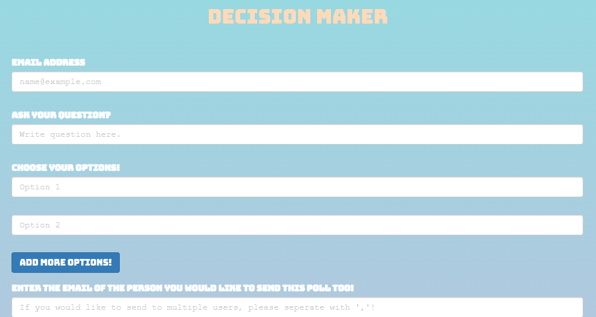
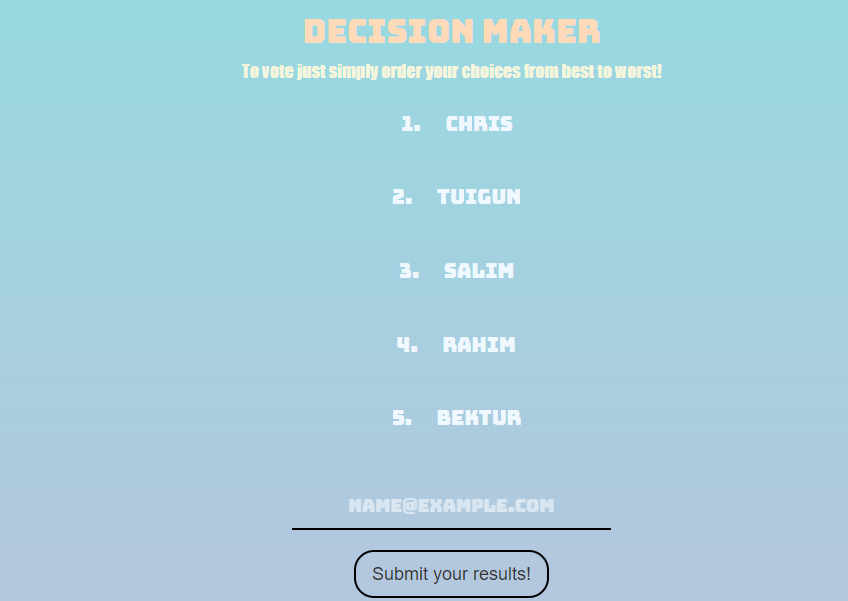
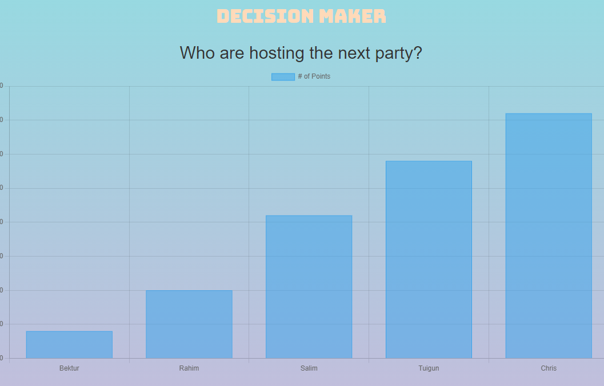

# Decision Maker 

This midterm project is a full stack web application built for a group of friends, collegues or relatives to vote and get some decision.

## Screenshots

## Decision Maker features:
- mailing(creation/vote notifications);
- responsive design;
- borda voting method
- chart

## Dependencies

- Node.js
- Express
- EJS
- Dotenv
- mailgun
- psql
- charts.js

## Getting Started

1. Create the `.env` by using `.env.example` as a reference: `cp .env.example .env`
2. Update the .env file with your correct local information
3. Install dependencies: `npm i`
4. Fix to binaries for sass: `npm rebuild node-sass`
5. Run migrations: `npm run knex migrate:latest`
  - Check the migrations folder to see what gets created in the DB
6. Run the seed: `npm run knex seed:run`
  - Check the seeds file to see what gets seeded in the DB
7. Run the server: `npm run local`
8. Visit `http://localhost:8080/`
